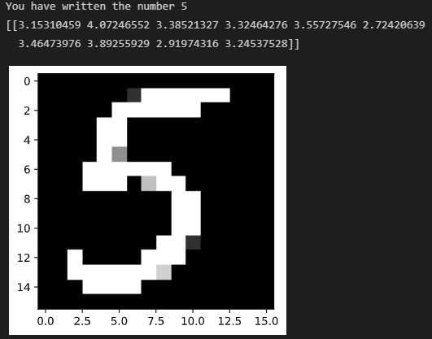

# Digit recognition with SVD (Singular Value Decomposition)
This repository contains a Python project with which one can perform automatic digit recognition. There is also a simple GUI where it is possible to write a digit and get the answer but it is also possible to upload a picture and get the answer. It is implemented for the digits from 0 to 9.  
It is based on the Singular Value Decomposition (SVD) where the image of a digit is flattened into a vector and with the use of orthogonal projections a distance vector from the selected digit and a dictionary of already computed SVD's of all the digits is computed. The orthonormal matrices $U$ and $V$ are in the dictionary for all ten digits and are computed beforehand on a set of examples. These matrices are used as the basis for the projection space. The right answer will be the entry with the least value i.e. distance between the flattened vector and the projection space.

  

